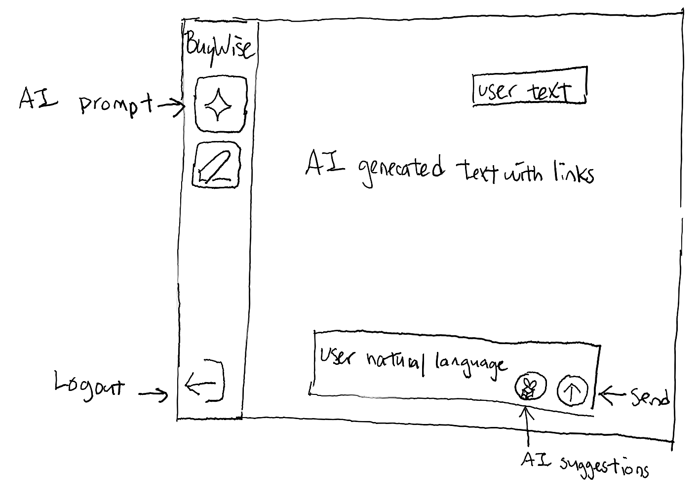
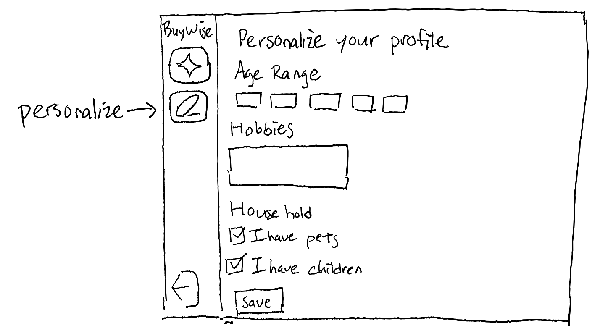
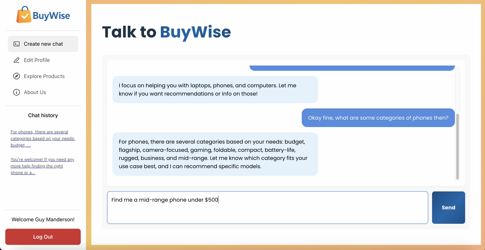
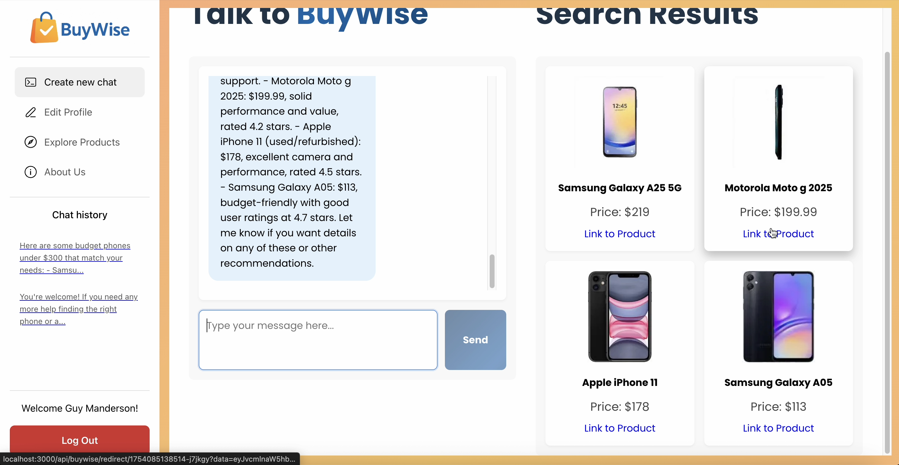
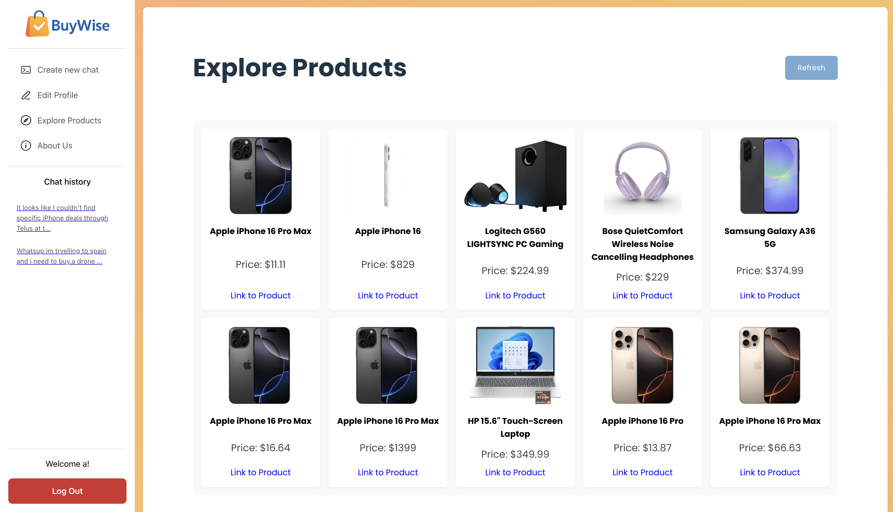

# 

# **BuyWise**

> **Smarter Shopping Starts Here.**
>
> By *TEAM 10 - Chris Tang, Brandon Kato, Dhruv Khanna, Zhong Tan*

---

**BuyWise** is a web application designed to streamline the online shopping experience by connecting users to their desired products quickly and efficiently across a wide range of popular e-commerce platforms.

Our platform allows users to:

* 🔍 **Search for items** across platforms like **Amazon**, **Walmart**, and **Kijiji** using **natural language**.
* 🛒 **Retrieve and display products** from third-party platforms in an intuitive, attractive interface.
* 🤖 **Get AI-driven recommendations** based on past searches and user preferences.
* 🧑‍💻 **Customize accounts** for a more personalized shopping experience.

---

## 🚀 **Key Features**

* **Cross-Platform Search**: Aggregate search results across Amazon, Walmart, Kijiji (and more coming soon).
* **Natural Language Processing**: Search by typing what you want — no complicated filters.
* **Personalized Recommendations**: AI-driven suggestions based on your interests and search history.
* **User Profiles**: Customize preferences including:

  * Age range
  * Brand preferences
  * Apparel sizes
  * Conversation history
* **Data-Driven Enhancements**:

  * Improve LLM (Language Model) prompts with user data.
  * Suggest complementary products based on past searches and shopping behavior.
* **Future Plans**:

  * Expand support to more e-commerce platforms.
  * Explore training a **predictive machine learning model** for enhanced recommendations beyond the LLM.

---

## 🗈️ **Wireframes**

**Main Page — Product Search Input**



> *Figure 1. Main page for users to input natural language product queries.*

---

**Profile Page — User Customization**



> *Figure 2. Profile page showing personal information and editable fields.*

---

## ⚙️ **Getting Started**

### 🐳 Docker Setup

```bash
docker compose build
docker compose up
```

Then navigate to:
👉 `http://localhost:5173` in your browser.

---

## 📚 **Technologies Used**

* **React.js + Vite.js** — Frontend framework and fast frontned tooling
* **MongoDB + Mongoose** — Database
* **JWT** — Authentication and user management
* **Docker** — Containerization and easy deployment
* **Natural Language Processing** — For intelligent search interpretation
* **LLM (Language Models)** — For dynamic product recommendation generation
* **Mocha, Chai, Sinon + Mocha reporter** — For integration testing of REST API endpoints and test reporter

---

## 👥 **Team**

* 🚀 Powered by the BuyWise Team

---

## **Final Release**

### **Highlights**

We have implemented our recommendation system that leverages user clickthroughs (data which we have been systematically collecting since the previous milestone). BuyWise now analyzes each user's product clicks to build personalized profiles and deliver intelligent product recommendations tailored to individual preferences and browsing behavior.

Additionally, BuyWise now features an advanced personalized AI filter that customizes product results during chat interactions. This intelligent filtering system ensures that products returned align with users' desired characteristics such as budget preferences, brand inclinations, and other specific requirements based on their previous queries and interactions.

### **Demo**

This section showcases the key features of BuyWise through our interactive demo, highlighting the core functionality that makes our platform unique and user-friendly.



> *Figure 3. Engage in dynamic conversations with our intelligent chatbot agent. BuyWise supports casual small talk, provides guidance on product categories it can assist with, and excels at finding products online through natural language queries. The AI intelligently filters search results based on your previous preferences and search history, ensuring personalized recommendations that align with your established shopping patterns and interests.*



> *Figure 4. Browse through the curated products provided by BuyWise in an intuitive, grid-based interface. Each product card displays essential information and direct merchant links, allowing you to click through to the original retailer's website where you can complete your purchase.*



> *Figure 5. BuyWise recommendation engine on the Explore Products page. The displayed products are dynamically generated based on the user’s chat inputs and click behavior, offering a curated selection of devices tailored to the user’s preferences. The system blends NLP-driven insights from recent conversations (shown in the chat history on the left) with interaction data, and surfaces results with significantly improved performance through caching and parallel API execution. The “Refresh” button allows users to manually override the cache and fetch the latest personalized recommendations instantly.*

### **Standard Goals**

- Design an attractive and user-friendly interface for browsing and comparing products (COMPLETED)
-  Leverage user profile setttings and past interactions to personalize chatbot responses and product recommendations (COMPLETED)
- Implement a chatbot using prompt engineering for natural language product queries (COMPLETED)
- Utilize Auth0 for secure authentication and user profile management (COMPLETED)
- Enable users to view and revisit past chat sessions with the AI assistant (COMPLETED)
- Ensure reliable integration with third-party e-commerce APIs (COMPLETED)

### **Stretch Goals**

- Refactor the chatbot to use LangChain for advanced natural language understanding and improved scalability (COMPLETED)
- Implement a machine learning-based recommendation system to suggest products tailored to user preferences and history (COMPLETED)
- Replace Auth0 with a custom authentication and verification system for enhanced control and flexibility (CHANGED)
  - The verification system was converted to JWT with encryption
  - We wanted to learn more about how to create an authentication system from scratch
  - Did not implement email verification, we instead focused our efforts on securing backend endpoints, enforcing authentication/authorization using encrypted JWTs

### **Non-Trivial Elements**

| Element                                      | Stage of Completion   |
|----------------------------------------------------------|----------------------|
| Chatbot leveraging LangChain for natural language         | COMPLETED            |
| Machine learning-based recommendation system for tech products              | COMPLETED       |
| Bespoke login and verification system                    | CHANGED           |
| Create attractive and intuitive chatting interface                 | COMPLETED            |

As mentioned above, the scope of the email authentication and verification system was altered.